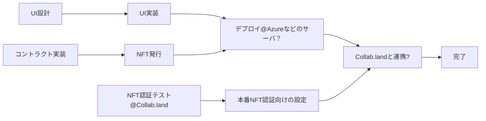

# 開発ロードマップ

```mermaid
flowchart LR
    A["NFT認証テスト@Collab.land"] --> B["本番NFT認証向けの設定"]
    C["UI設計"] --> D["UI実装"]
    E["コントラクト実装"] --> F["NFT発行"]
    D --> G["デプロイ@Azureなどのサーバ？"]
    F --> G
    G --> H["Collab.landと連携?"]
    B --> H
    H --> R["完了"]
``` 